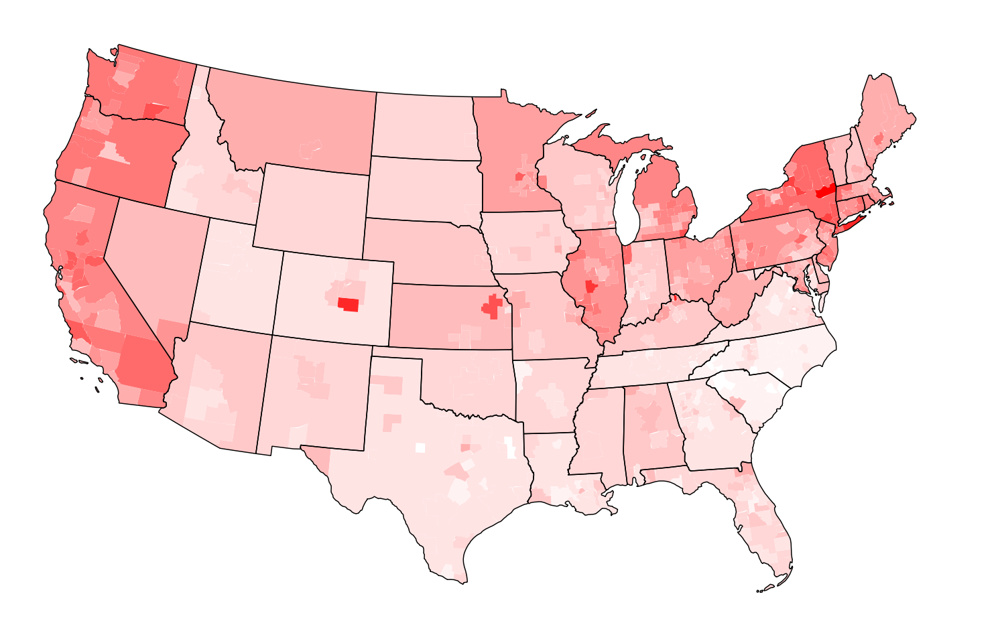

# Detailed Union Density

The [Current Population Survey](https://en.wikipedia.org/wiki/Current_Population_Survey) asks questions about union membership and representation and provides some geographic information about respondents.

The survey always reports the state of the respondent. If the subdivision is populous enough, CPS will also report if the respondent is in one of 260 [CBSAs](https://en.wikipedia.org/wiki/Core-based_statistical_area), one of 281 counties, or one of 97 cities. The states, CBSAs, counties, and cities combine and intersect to produce 578 distinct geographies.

This repository contains mapping data for the estimated employment, union membership, and union representation for each of those geographies. It's the most geographically detailed information about union density in the United States that I know of.

[](https://datawrapper.dwcdn.net/LMqXU/3/)

## Contents
### Density Data
- CBSA Density: [geojson](metro_density.geojson), [csv](metro_density.csv)
- County Density: [geojson](county_density.geojson), [csv](county_density.csv)
- City Density: [geojson](city_density.geojson), [csv](city_density.csv)
- Intersecting Geographies (most geographically detailed): [geojson](union_density.geojson)

### Resources
- Current Population Survey Geographies. An individual geography in CPS is identified by a unique combination of the `METFIPS`, `STATEFIP`, `COUNTY` and `INDIVIDCC` fields. This [geojson file maps those combinations to geographies](cps_geography.geojson)
- Current Population Survey City Mapping. [This CSV](city_map.csv) maps `METFIPS`, `STATEFIP`, `COUNTY` and `INDIVIDCC` to the names and Census geographic identifiers of cities.

### Code
- The code for building these files are the [Makefile](Makefile) and SQL scripts in the [./scripts](scripts/) directory.

## To run code
### System Requirements
- spatialite
- wget
- gdal

### To run
```bash
> make
```
